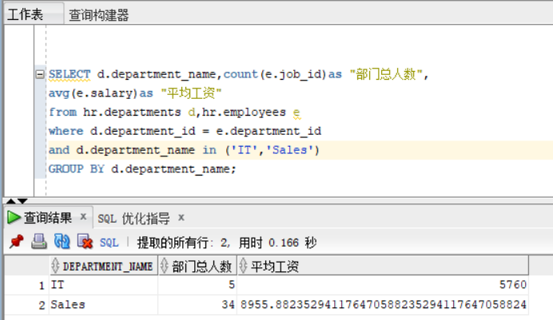
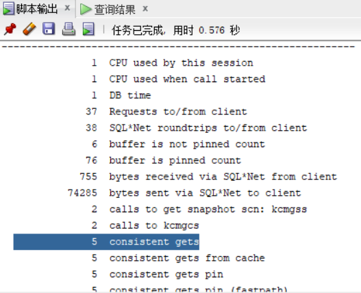
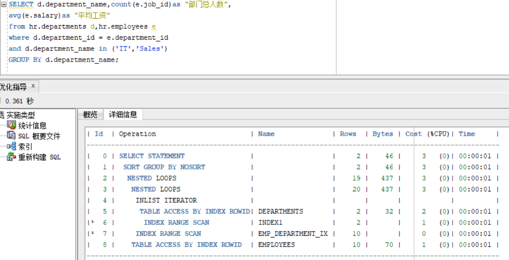
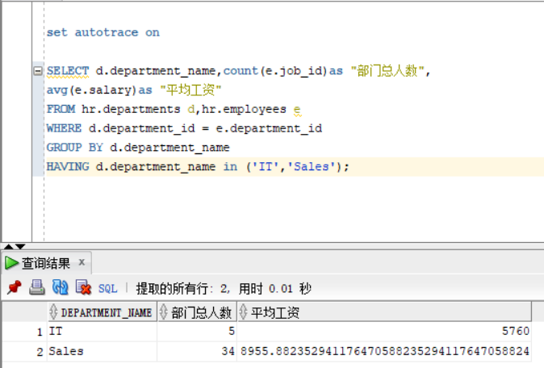
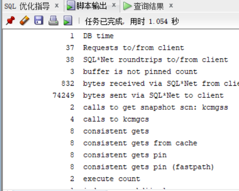
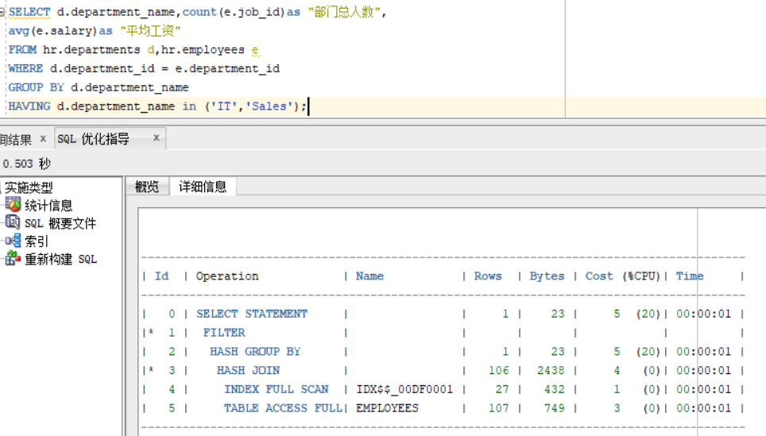
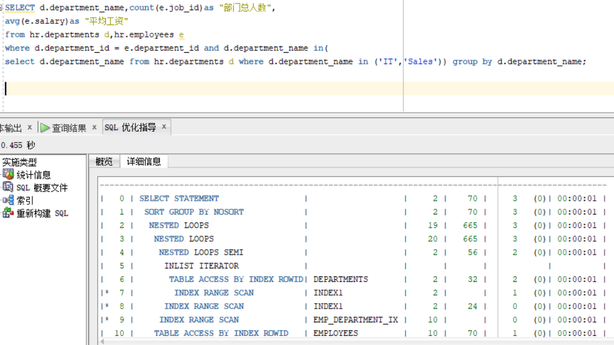
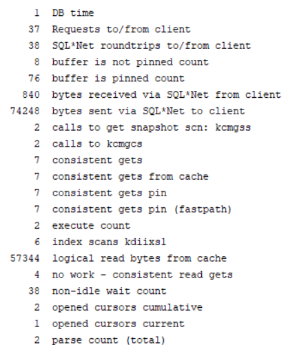

## 实验1：SQL语句的执行计划分析与优化指导

#### **实验目的**

​	分析SQL执行计划，执行SQL语句的优化指导。理解分析SQL语句的执行计划的重要作用。

#### **实验内容**

- 对Oracle12c中的HR人力资源管理系统中的表进行查询与分析。
- 首先运行和分析教材中的样例：本训练任务目的是查询两个部门('IT'和'Sales')的部门总人数和平均工资，以下两个查询的结果是一样的。但效率不相同。
- 设计自己的查询语句，并作相应的分析，查询语句不能太简单。

#### **实验步骤**

##### 	执行查询1：

##### 	选择优化后：

##### 	执行查询2：

##### 	选择优化后：

##### 自己设计的查询语句：

​							

#### 分析结果：

​	分析查询语句1和查询语句2：

​		对于查询语句1中consistents gets = 5和查询语句2中的consistents gets = 9，并且其他参数都比查询语句2更优。而对于查询语句1是先过滤后汇总。参与汇总与计算的数据量较少。而查询语句2的为先汇总后过滤，参与汇总与计算的数据量较多。所以综上分析可以看出查询语句1更加好。

​	分析自己写的查询语句：

​		这可以先比较两者的的运行结果一致并且运行效率也相差不大，所以可以推断出两者的优化是差不多的。其实这里自己编写的查询语句和语句1没有本质的区别，都是先过滤后汇总，不过这里自己编写的查询语句的过滤语句使用了多重查询，这样看起来可能更加的明显，但是效率没有明显的弱于查询语句1。

 

