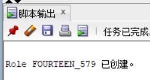
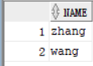
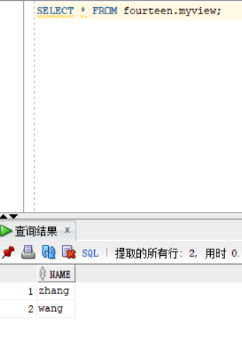
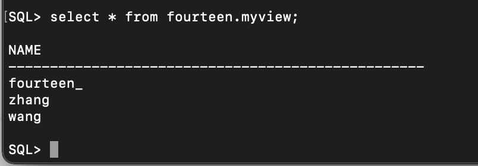
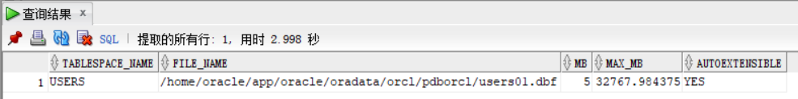
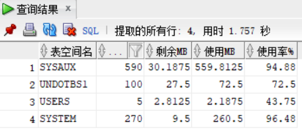

# 实验2：用户及权限管理


## 实验目的

掌握用户管理、角色管理、权根维护与分配的能力，掌握用户之间共享对象的操作技能。

## 实验内容

Oracle有一个开发者角色resource，可以创建表、过程、触发器等对象，但是不能创建视图。本训练要求：

- 在pdborcl插接式数据中创建一个新的本地角色**fourteen_579**，该角色包含connect和resource角色，同时也包含CREATE VIEW权限，这样任何拥有**fourteen_579**的用户就同时拥有这三种权限。
- 创建角色之后，再创建用户**fourteen**，给用户分配表空间，设置限额为50M，授予**fourteen_579**角色。
- 最后测试：用新用户**fourteen**连接数据库、创建表，插入数据，创建视图，查询表和视图的数据。

## 实验步骤

- 第1步：以system登录到pdborcl，创建角色**fourteen_579**和用户**fourteen**，并授权和分配空间：

```sql
CREATE role fourteen_579;
grant connect,resource,create view to fourteen_579;
CREATE USER fourteen IDENTIFIED BY "123" DEFAULT TABLESPACE users TEMPORARY TABLESPACE temp;
ALTER USER fourteen QUOTA 50M ON users;
GRANT fourteen_579 TO fourteen;
```

执行结果：




- 第2步：新用户**fourteen**连接到pdborcl，创建表mytable和视图myview，插入数据，最后将myview的SELECT对象权限授予hr用户。

  ```sql
  show user;
  CREATE TABLE mytable (id number,name varchar(50));
  INSERT INTO mytable(id,name)VALUES(1,'zhang');
  INSERT INTO mytable(id,name)VALUES (2,'wang');
  CREATE VIEW myview AS SELECT name FROM mytable;
  SELECT * FROM myview;
  GRANT SELECT ON myview TO hr;
  ```

  执行结果：

  

  

- 第3步：用户hr连接到pdborcl，查询**fourteen**授予它的视图myview

  ```sql
  SELECT * FROM new_user.myview;
  ```

  执行结果：

  

  

- 第4步：测试同学之间的用户表的共享，此时加了一条数据以显示区别

  ```sql
  INSERT INTO mytable(id,name)VALUES (3,'fourteen_');
  GRANT SELECT ON myview TO new_user_xxx;
  ```

  执行结果：

  

  在同学用户下可以查看到以下结果（成功读入）：

  

## 数据库和表空间占用分析

> 当全班同学的实验都做完之后，数据库pdborcl中包含了每个同学的角色和用户。 所有同学的用户都使用表空间users存储表的数据。 表空间中存储了很多相同名称的表mytable和视图myview，但分别属性于不同的用户，不会引起混淆。 随着用户往表中插入数据，表空间的磁盘使用量会增加。

## 查看数据库的使用情况

查看表空间的数据库文件，以及每个文件的磁盘占用情况。

```sql
SELECT tablespace_name,FILE_NAME,BYTES/1024/1024 MB,MAXBYTES/1024/1024 MAX_MB,autoextensible 
    FROM dba_data_files  WHERE  tablespace_name='USERS';
```

查询结果1：




```sql
SELECT a.tablespace_name "表空间名",Total/1024/1024 "大小MB",
 free/1024/1024 "剩余MB",( total - free )/1024/1024 "使用MB",
 Round(( total - free )/ total,4)* 100 "使用率%"
 from (SELECT tablespace_name,Sum(bytes)free
        FROM   dba_free_space group  BY tablespace_name)a,
       (SELECT tablespace_name,Sum(bytes)total FROM dba_data_files
        group  BY tablespace_name)b
 where  a.tablespace_name = b.tablespace_name;
```

查询结果2：



