# 实验3：创建分区表

## 实验目的：

掌握分区表的创建方法，掌握各种分区方式的使用场景。

## 实验内容：

- 本实验使用3个表空间：USERS,USERS02,USERS03。在表空间中创建两张表：订单表(orders)与订单详表(order_details)。
- 使用**自己的账号创建本实验的表**，表创建在上述3个分区，自定义分区策略。
- 使用system用户给自己的账号分配上述分区的使用权限。你需要使用system用户给你的用户分配可以查询执行计划的权限。
- 表创建成功后，插入数据，数据能并平均分布到各个分区。每个表的数据都应该大于1万行，对表进行联合查询。
- 写出插入数据的语句和查询数据的语句，并分析语句的执行计划。
- 进行分区与不分区的对比实验。

## 实验步骤：

##### 创建用户(*<u>fourteen</u>*)：

```sql
ALTER USER fourteen QUOTA UNLIMITED ON USERS;
ALTER USER fourteen QUOTA UNLIMITED ON USERS02;
ALTER USER fourteen QUOTA UNLIMITED ON USERS03;
```

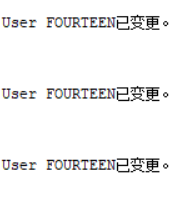

##### 运行test3.sql(没有直接运行全部文件，而是分步运行方便截图，具体步骤见后):

##### 授予用户权限：

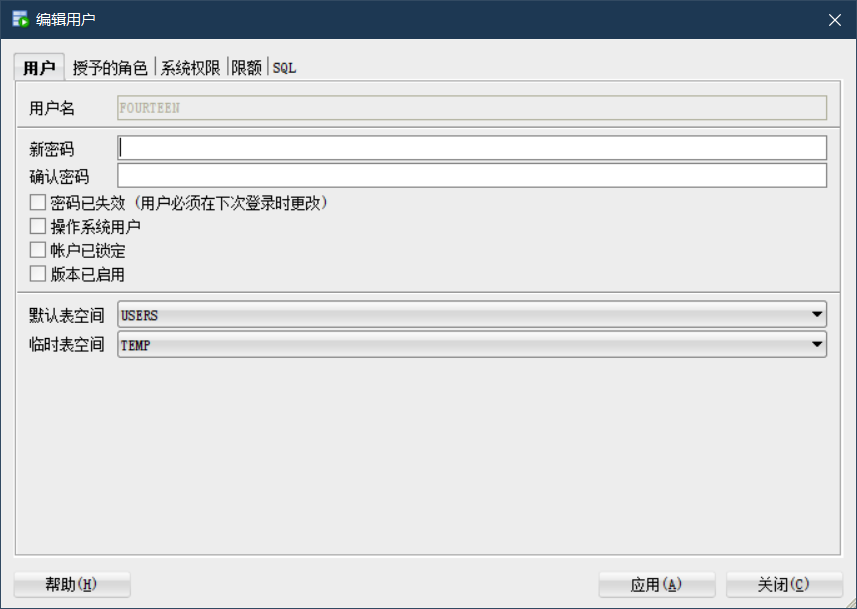

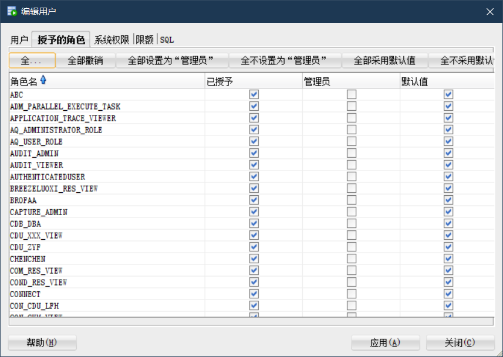

##### 执行：

```sql
declare
      num   number;
begin
      select count(1) into num from user_tables where TABLE_NAME = 'ORDER_DETAILS';
      if   num=1   then
          execute immediate 'drop table ORDER_DETAILS cascade constraints PURGE';
      end   if;

      select count(1) into num from user_tables where TABLE_NAME = 'ORDERS';
      if   num=1   then
          execute immediate 'drop table ORDERS cascade constraints PURGE';
      end   if;
end;
```


##### 创建表：

在主表orders和从表order_details之间建立引用分区 在study用户中创建两个表：orders（订单表）和order_details（订单详表），两个表通过列order_id建立主外键关联。orders表按范围分区进行存储，order_details使用引用分区进行存储。 

##### 创建orders表：

```sql
CREATE TABLE orders (
    order_id          NUMBER(10, 0) NOT NULL,
    customer_name     VARCHAR2(40 BYTE) NOT NULL,
    customer_tel      VARCHAR2(40 BYTE) NOT NULL,
    order_date        DATE NOT NULL,
    employee_id       NUMBER(6, 0) NOT NULL,
    discount          NUMBER(8, 2) DEFAULT 0,
    trade_receivable  NUMBER(8, 2) DEFAULT 0,
    CONSTRAINT orders_pk PRIMARY KEY ( order_id )
        USING INDEX (
            CREATE UNIQUE INDEX orders_pk ON
                orders (
                    order_id
                ASC )
                    LOGGING TABLESPACE users PCTFREE 10 INITRANS 2
                        STORAGE ( BUFFER_POOL DEFAULT )
                        NOPARALLEL
        )
    ENABLE
)
TABLESPACE users PCTFREE 10 INITRANS 1
    STORAGE ( BUFFER_POOL DEFAULT )
NOCOMPRESS
        NOPARALLEL
        PARTITION BY RANGE (
            order_date
        )
        ( PARTITION partition_2015
            VALUES LESS THAN ( to_date(' 2016-01-01 00:00:00', 'SYYYY-MM-DD HH24:MI:SS', 'NLS_CALENDAR=GREGORIAN') )
        NOLOGGING TABLESPACE users PCTFREE 10 INITRANS 1
            STORAGE ( INITIAL 8388608 NEXT 1048576 MINEXTENTS 1 MAXEXTENTS UNLIMITED BUFFER_POOL DEFAULT )
        NOCOMPRESS NO INMEMORY,
        PARTITION partition_2016
            VALUES LESS THAN ( to_date(' 2017-01-01 00:00:00', 'SYYYY-MM-DD HH24:MI:SS', 'NLS_CALENDAR=GREGORIAN') )
        NOLOGGING TABLESPACE users PCTFREE 10 INITRANS 1
            STORAGE ( BUFFER_POOL DEFAULT )
        NOCOMPRESS NO INMEMORY,
        PARTITION partition_2017
            VALUES LESS THAN ( to_date(' 2018-01-01 00:00:00', 'SYYYY-MM-DD HH24:MI:SS', 'NLS_CALENDAR=GREGORIAN') )
        NOLOGGING TABLESPACE users PCTFREE 10 INITRANS 1
            STORAGE ( BUFFER_POOL DEFAULT )
        NOCOMPRESS NO INMEMORY,
        PARTITION partition_2018
            VALUES LESS THAN ( to_date(' 2019-01-01 00:00:00', 'SYYYY-MM-DD HH24:MI:SS', 'NLS_CALENDAR=GREGORIAN') )
        NOLOGGING TABLESPACE users02 PCTFREE 10 INITRANS 1
            STORAGE ( BUFFER_POOL DEFAULT )
        NOCOMPRESS NO INMEMORY,
        PARTITION partition_2019
            VALUES LESS THAN ( to_date(' 2020-01-01 00:00:00', 'SYYYY-MM-DD HH24:MI:SS', 'NLS_CALENDAR=GREGORIAN') )
        NOLOGGING TABLESPACE users02 PCTFREE 10 INITRANS 1
            STORAGE ( BUFFER_POOL DEFAULT )
        NOCOMPRESS NO INMEMORY,
        PARTITION partition_2020
            VALUES LESS THAN ( to_date(' 2021-01-01 00:00:00', 'SYYYY-MM-DD HH24:MI:SS', 'NLS_CALENDAR=GREGORIAN') )
        NOLOGGING TABLESPACE users02 PCTFREE 10 INITRANS 1
            STORAGE ( BUFFER_POOL DEFAULT )
        NOCOMPRESS NO INMEMORY,
        PARTITION partition_2021
            VALUES LESS THAN ( to_date(' 2022-01-01 00:00:00', 'SYYYY-MM-DD HH24:MI:SS', 'NLS_CALENDAR=GREGORIAN') )
        NOLOGGING TABLESPACE users03 PCTFREE 10 INITRANS 1
            STORAGE ( BUFFER_POOL DEFAULT )
        NOCOMPRESS NO INMEMORY );

```

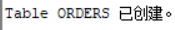

##### 创建order_details表：

```sql
CREATE TABLE order_details (
    id             NUMBER(10, 0) NOT NULL,
    order_id       NUMBER(10, 0) NOT NULL,
    product_name   VARCHAR2(40 BYTE) NOT NULL,
    product_num    NUMBER(8, 2) NOT NULL,
    product_price  NUMBER(8, 2) NOT NULL,
    CONSTRAINT order_details_fk1 FOREIGN KEY ( order_id )
        REFERENCES orders ( order_id )
    ENABLE
)
TABLESPACE users PCTFREE 10 INITRANS 1
    STORAGE ( BUFFER_POOL DEFAULT )
NOCOMPRESS
        NOPARALLEL
        PARTITION BY REFERENCE ( order_details_fk1 );
```

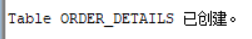

##### 插入数据：

```sql
DECLARE
    dt                 DATE;
    m                  NUMBER(8, 2);
    v_employee_id      NUMBER(6);
    v_order_id         NUMBER(10);
    v_name             VARCHAR2(100);
    v_tel              VARCHAR2(100);
    v                  NUMBER(10, 2);
    v_order_detail_id  NUMBER;
BEGIN
    v_order_detail_id := 1;
    DELETE FROM order_details;

    DELETE FROM orders;

    FOR i IN 1..10000 LOOP
        IF i MOD 6 = 0 THEN
            dt := TO_DATE('2015-3-2', 'yyyy-mm-dd') + ( i MOD 60 ); --PARTITION_2015
        ELSIF i MOD 6 = 1 THEN
            dt := TO_DATE('2016-3-2', 'yyyy-mm-dd') + ( i MOD 60 ); --PARTITION_2016
        ELSIF i MOD 6 = 2 THEN
            dt := TO_DATE('2017-3-2', 'yyyy-mm-dd') + ( i MOD 60 ); --PARTITION_2017
        ELSIF i MOD 6 = 3 THEN
            dt := TO_DATE('2018-3-2', 'yyyy-mm-dd') + ( i MOD 60 ); --PARTITION_2018
        ELSIF i MOD 6 = 4 THEN
            dt := TO_DATE('2019-3-2', 'yyyy-mm-dd') + ( i MOD 60 ); --PARTITION_2019
        ELSE
            dt := TO_DATE('2020-3-2', 'yyyy-mm-dd') + ( i MOD 60 ); --PARTITION_2020
        END IF;

        v_employee_id :=
            CASE i MOD 6
                WHEN 0 THEN
                    11
                WHEN 1 THEN
                    111
                WHEN 2 THEN
                    112
                WHEN 3 THEN
                    12
                WHEN 4 THEN
                    121
                ELSE 122
            END;
    --插入订单
        v_order_id := i;
        v_name := 'aa' || 'aa';
        v_name := 'zhang' || i;
        v_tel := '139888883' || i;
        INSERT /*+append*/ INTO orders (
            order_id,
            customer_name,
            customer_tel,
            order_date,
            employee_id,
            discount
        ) VALUES (
            v_order_id,
            v_name,
            v_tel,
            dt,
            v_employee_id,
            dbms_random.value(100, 0)
        );
    --插入订单y一个订单包括3个产品
        v := dbms_random.value(10000, 4000);
        v_name := 'computer' || ( i MOD 3 + 1 );
        INSERT /*+append*/ INTO order_details (
            id,
            order_id,
            product_name,
            product_num,
            product_price
        ) VALUES (
            v_order_detail_id,
            v_order_id,
            v_name,
            2,
            v
        );

        v := dbms_random.value(1000, 50);
        v_name := 'paper' || ( i MOD 3 + 1 );
        v_order_detail_id := v_order_detail_id + 1;
        INSERT /*+append*/ INTO order_details (
            id,
            order_id,
            product_name,
            product_num,
            product_price
        ) VALUES (
            v_order_detail_id,
            v_order_id,
            v_name,
            3,
            v
        );

        v := dbms_random.value(9000, 2000);
        v_name := 'phone' || ( i MOD 3 + 1 );
        v_order_detail_id := v_order_detail_id + 1;
        INSERT /*+append*/ INTO order_details (
            id,
            order_id,
            product_name,
            product_num,
            product_price
        ) VALUES (
            v_order_detail_id,
            v_order_id,
            v_name,
            1,
            v
        );
    --在触发器关闭的情况下，需要手工计算每个订单的应收金额：
        SELECT
            SUM(product_num * product_price)
        INTO m
        FROM
            order_details
        WHERE
            order_id = v_order_id;

        IF m IS NULL THEN
            m := 0;
        END IF;
        UPDATE orders
        SET
            trade_receivable = m - discount
        WHERE
            order_id = v_order_id;

        IF i MOD 1000 = 0 THEN
            COMMIT; --每次提交会加快插入数据的速度
        END IF;
    END LOOP;

END;

```

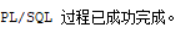

##### 查看数据：

```sql
SELECT
    COUNT(*)
FROM
    orders;
```

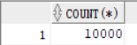

```sql
SELECT
    COUNT(*)
FROM
    order_details;
```

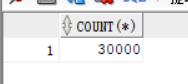

##### 以system身份查看：

```sql
set autotrace on

select * from fourteen.orders where order_date
between to_date('2017-1-1','yyyy-mm-dd') and to_date('2018-6-1','yyyy-mm-dd');
```

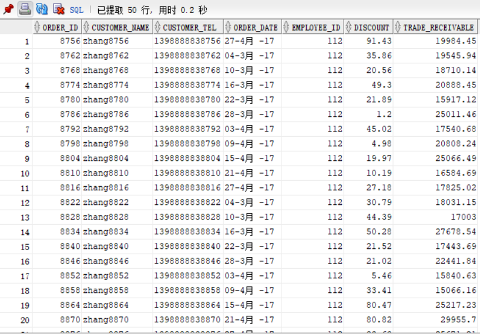

```sql
select a.ORDER_ID,a.CUSTOMER_NAME,
b.product_name,b.product_num,b.product_price
from fourteen.orders a,fourteen.order_details b where
a.ORDER_ID=b.order_id and
a.order_date between to_date('2017-1-1','yyyy-mm-dd') and to_date('2018-6-1','yyyy-mm-dd');
```

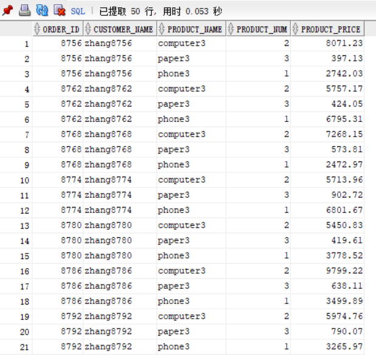

## 查看数据库的使用情况

以下样例查看表空间的数据库文件，以及每个文件的磁盘占用情况。

```sql
SELECT tablespace_name,FILE_NAME,BYTES/1024/1024 MB,MAXBYTES/1024/1024 MAX_MB,autoextensible FROM dba_data_files  WHERE  tablespace_name='USERS';
```

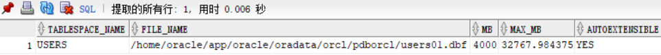

```sql
SELECT a.tablespace_name "表空间名",Total/1024/1024 "大小MB",
 free/1024/1024 "剩余MB",( total - free )/1024/1024 "使用MB",
 Round(( total - free )/ total,4)* 100 "使用率%"
 from (SELECT tablespace_name,Sum(bytes)free
        FROM   dba_free_space group  BY tablespace_name)a,
       (SELECT tablespace_name,Sum(bytes)total FROM dba_data_files
        group  BY tablespace_name)b
 where  a.tablespace_name = b.tablespace_name;
```

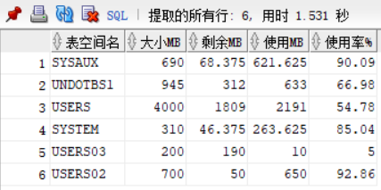

- autoextensible是显示表空间中的数据文件是否自动增加。
- MAX_MB是指数据文件的最大容量。