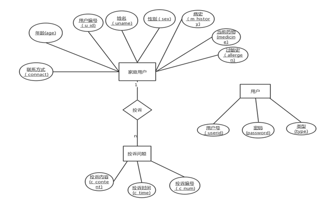

## 实验6（期末考核） 基于Oracle的*家庭医疗信息系统* 数据库设计 

- 期末考核要求
  - 自行设计一个信息系统的数据库项目，自拟`某项目`名称。
  - 设计项目涉及的表及表空间使用方案。至少5张表和5万条数据，两个表空间。*（实验三）*
  - 设计权限及用户分配方案。至少两类角色，两个用户。*（实验二）*
  - 在数据库中建立一个程序包，在包中用PL/SQL语言设计一些存储过程和函数，实现比较复杂的业务逻辑，用模拟数据进行执行计划分析。（实验五）
  - 设计自动备份方案或则手工备份方案。（网站）
  - 设计容灾方案。使用两台主机，通过DataGuard实现数据库整体的异地备份(可选)。（网站）


## 实验注意事项

- 完成时间： 2021-6-15日前上交

- 实验在自己的计算机上完成。
- 文档必须提交到你的Oracle项目中的test6目录中。文档必须上传两套，因此你的test6目录中必须至少有两个文件：
  - 一个是Markdown格式的，文件名称是test6.md。
  - 另一个是Word格式的，文件名称是test6_design.docx。
  - 注意：test6_design.docx`必须在2021-06-01日打印出来上交给老师`。至少20页，1万字。
- 上交后，通过这个地址应该可以打开你的源码：https://github.com/你的用户名/oracle/tree/master/test6
- 文档中所有设计和数据都必须是你自己独立完成的真实实验结果。不得抄袭，杜撰。


## 实验内容

### 数据库基本描述

本系统包括了两种用户类型：家庭用户和在线专家。家庭用户通过注册进入系统登记个人信息，输入自己的健康状态，家庭可收集的诊断测试结果（如有）或向在线专家提问。进行咨询。

在线专家注册登录系统后登记个人信息，可以浏览家庭用户的名单和问题，并使用该系统输入诊断，治疗建议和回答家庭用户提出的问题。


### **系统结构**

****


### E-R图

总图：

****

分图:

****

****

****

****


### **表结构**

#### 关系模式：

用户表：users(u_id,uname,sex,number,connact,m_history,medicine,allergen,e_num)

专家表：expert(e_num,e_sex,e_connact,e_post)

投诉表: complaint(c_num,u_id,c_time,c_content)

症状表:features(f_num,u_id,f_severity,f_des,f_time)

诊断表：diagnose(f_num,e_num,d_name,d_type,d_time,d_des,d_suggest)

问题表:problem(p_num,u_id,p_title,p_type,p_time,p_text)

回答表:answer(p_num,e_num,a_time,a_text,a_type)

测试表:beta(b_num,u_id,b_time,b_process,b_condtino,b_method,b_out)

治疗表:treat(b_num,e_num,t_name,t_type,t_des)

注册表:use_info(useid,password,type)


#### 物理模型：

用户表

| 字段名    | 数据类型 | 允许空 | 主/外键 | 检查条件                |
| --------- | -------- | ------ | ------- | ----------------------- |
| u_id      | numeric  | no     | 主键    |                         |
| uname     | varchar  |        |         |                         |
| sex       | char     |        |         | ‘男’或’女’ 默认值为’男’ |
| age       | number   |        |         |                         |
| connact   | varchar  |        |         |                         |
| m_history | varchar  |        |         |                         |
| medicine  | varchar  |        |         |                         |
| allergen  | varchar  |        |         |                         |
| e_num     | numberic |        | 外键    |                         |

 

专家表

| 字段名    | 数据类型 | 允许空 | 主/外键 | 检查条件                |
| --------- | -------- | ------ | ------- | ----------------------- |
| e_num     | numeric  | no     | 主键    |                         |
| e_name    | varchar  |        |         |                         |
| e_sex     | char     |        |         | ‘男’或’女’ 默认值为’男’ |
| e_connact | varchar  |        |         |                         |
| e_post    | varchar  |        |         |                         |

 

投诉表

| 字段名    | 数据类型 | 允许空 | 主/外键 | 检查条件 |
| --------- | -------- | ------ | ------- | -------- |
| c_num     | numeric  | no     | 主键    |          |
| u_id      | numeric  |        | 外键    |          |
| c_time    | date     |        |         |          |
| c_content | varchar  |        |         |          |

 

症状表

| 字段名     | 数据类型 | 允许空 | 主/外键 | 检查条件             |
| ---------- | -------- | ------ | ------- | -------------------- |
| f_num      | varchar  | no     | 主键    |                      |
| u_id       | numeric  |        | 外键    |                      |
| f_severity | char     |        |         | ‘轻度’,’中度’,’严重’ |
| f_des      | varchar  |        |         |                      |
| f_time     | date     |        |         |                      |

 

诊断表

| 字段名      | 数据类型 | 允许空 | 主/外键 | 检查条件 |
| ----------- | -------- | ------ | ------- | -------- |
| f_num       | varchar  |        | 外键    |          |
| e_num       | numeric  |        | 外键    |          |
| d_name      | varchar  |        |         |          |
| d_type      | varchar  |        |         |          |
| d_time      | date     |        |         |          |
| d_des       | varchar  |        |         |          |
| d_suggest   | varchar  |        |         |          |
| f_num,e_num |          |        | 主键    |          |

 

问题表

| 字段名  | 数据类型 | 允许空 | 主/外键 | 检查条件                       |
| ------- | -------- | ------ | ------- | ------------------------------ |
| p_num   | varchar  | no     | 主键    |                                |
| u_id    | numeric  |        | 外键    |                                |
| p_title | varchar  |        |         |                                |
| p_type  | char     |        |         | ‘公开’或’私人’  默认值为’公开’ |
| p_time  | date     |        |         |                                |
| p_text  | varchar  |        |         |                                |

 

回答表

| 字段名      | 数据类型 | 允许空 | 主/外键 | 检查条件                       |
| ----------- | -------- | ------ | ------- | ------------------------------ |
| p_num       | varchar  |        | 外键    |                                |
| e_num       | numeric  |        | 外键    |                                |
| a_time      | Date     |        |         |                                |
| a_text      | varchar  |        |         |                                |
| a_type      | char     |        |         | ‘公开’或’私人’  默认值为’公开’ |
| p_num,e_num |          |        | 主键    |                                |

 

测试表

| 字段名     | 数据类型 | 允许空 | 主/外键 | 检查条件                       |
| ---------- | -------- | ------ | ------- | ------------------------------ |
| b_num      | numeric  | no     | 主键    |                                |
| u_id       | numeric  |        | 外键    |                                |
| b_time     | date     |        |         |                                |
| b_process  | varchar  |        |         |                                |
| b_condtion | varchar  |        |         |                                |
| b_method   | varchar  |        |         |                                |
| b_out      | char     |        |         | ‘阳性’或’阴性’  默认值为’阳性’ |

 

治疗表

| 字段名      | 数据类型 | 允许空 | 主/外键 | 检查条件 |
| ----------- | -------- | ------ | ------- | -------- |
| b_num       | numeric  |        | 外键    |          |
| e_num       | numeric  |        | 外键    |          |
| t_name      | varchar  |        |         |          |
| t_type      | varchar  |        |         |          |
| t_des       | varchar  |        |         |          |
| b_num,e_num |          |        | 主键    |          |

 

注册表

| 字段名   | 数据类型 | 允许空 | 主/外键 | 检查条件                       |
| -------- | -------- | ------ | ------- | ------------------------------ |
| useid    | numeric  | no     | 主键    |                                |
| password | varchar  | no     |         |                                |
| type     | varchar  |        |         | ‘专家’或‘用户’  默认值为‘用户’ |

 

### 功能实现

#### 数据操作

全部的数据操作都采用存储过程来进行。

##### 插入数据

总共有10张基本表，创建了10个存储过程对每个基本表插入数据。

[saveSql.sql](saveSql.sql)


#### 视图

1. 创建了从users，problem，answer表产生的一个视图p_answer，它包括用户号，用户姓名，问题类型，问题标题，问题内容，提问时间，回答时间，回答内容。

```sql
create view p_ answer
as select users.u_id, uname, p_title, p_type, p_time, p_text, a_text, a_time
from users, problem, answer
where users. u_id=problem.u_id and problem.p_num=answe.p_num;
```

结果显示


2. 创建了从users，features，diagnose，expert表中产生一个视图f_diagnose,他包括用户姓名，症状严重程度，症状描述，症状输入时间，疾病名称，疾病类型，诊断时间，专家姓名。

```sql
create view f_diagnose
as select users.uname, f_severity, f_des, f_time, d_name, d_type, d_time, e_name
from users, features, diagnose, expert
where users.u_id=features.u_id and features.f_num=diagnose.f_num and diagnose.e_num=expert.e_num; 
```

结果显示


#### 函数

1. 创建了一个自定义函数方便的统计对应专家编号回答了多少道问题

```sql
create or replace function count_s(enu expert.e_num%type)
return number is
rowcount number;
begin
select count (e_num)
into rowcount
from answer
where e_num=enu;
return rowcount;
end;
/
```

结果显示：


2. 创建了一个自定义函数通过用户编号搜索用户的个人信息

```sql
create or replace function sev_u(uid users.u_id%type)
return varchar2 is
usss users%rowtype;
begin
select * into usss
from users
where u_id=uid;
return ('姓名:'||usss. uname||'年龄:' ||'usss. age'||'性别: '||usss. sex||'联系方式: '||usss. connact);
end;
/
```

结果显示：


#### 存储过程

1.创建更新指定问题标号和专家编号的回答内容的存储过程

```sql
create or replace procedure update_answer(u_p_num answer.p_num%type,u_e_num answer.e_num%type,u_a_text answe.a_text%type)
begin
update answer
set a_text=u_a_text 
where answer.p_num=u_p_num and answer.e_num=u_e_num;
end;
/
```

2.创建查询姓李的用户的姓名的存储过程

```sql
create or replace procedure se_users
is
v_name users.uname%type;
begin
select uname into v_name 
from users
where uname like '李%';
end;
/
```


### 备份方案(在SQL Server中备份)

- bat命令备份

```bash
@echo off
set path=%path%;[osql.exe]
echo 数据库备份开始
osql.exe -S 202.115.82.8 -U 'fourteen' -P '123' -i sqlserverbackup.sql -o 'D:\Sql Developer\sql\out.bak'
echo 数据库备份完成
Pause
```

- 创建sqlserverbackup.sql文件

```sql
DECLARE @name varchar(50)
DECLARE @datetime char(14)
DECLARE @path varchar(255)
DECLARE @bakfile varchar(255)
set @name='out'
set @datetime=CONVERT(char(8),getdate(),112) + REPLACE(CONVERT(char(8),getdate(),108),':','')
set @path='D:\Sql Developer\sql'
set @bakfile=@path+''+@name+'.BAK'
backup database @name to disk=@bakfile with name=@name
Go
```


### 容灾方案

- 主库查询确认组数


- 主库增加standbylogfile：

```sql
alter database add standby logfile  group 8 '/home/oracle/app/oracle/oradata/orcl/stdredo1.log' size 50m;
alter database add standby logfile  group 9 '/home/oracle/app/oracle/oradata/orcl/stdredo2.log' size 50m;
alter database add standby logfile  group 10 '/home/oracle/app/oracle/oradata/orcl/stdredo3.log' size 50m;
alter database add standby logfile  group 11 '/home/oracle/app/oracle/oradata/orcl/stdredo4.log' size 50m;
```

- 主库环境开启强制归档并修改参数

```sql
ALTER DATABASE FORCE LOGGING;

alter system set LOG_ARCHIVE_CONFIG='DG_CONFIG=(orcl,stdorcl)' scope=both sid='*';
alter system set log_archive_dest_1='LOCATION=/home/oracle/arch VALID_FOR=(ALL_LOGFILES,ALL_ROLES) DB_UNIQUE_NAME=orcl' scope=spfile;
alter system set LOG_ARCHIVE_DEST_2='SERVICE=stdorcl LGWR ASYNC  VALID_FOR=(ONLINE_LOGFILES,PRIMARY_ROLE) DB_UNIQUE_NAME=stdorcl' scope=both sid='*';
alter system set fal_client='orcl' scope=both sid='*';    
alter system set FAL_SERVER='stdorcl' scope=both sid='*';  
alter system set standby_file_management=AUTO scope=both sid='*';
alter system set DB_FILE_NAME_CONVERT='/home/oracle/app/oracle/oradata/stdorcl/','/home/oracle/app/oracle/oradata/orcl/' scope=spfile sid='*';  
alter system set LOG_FILE_NAME_CONVERT='/home/oracle/app/oracle/oradata/stdorcl/','/home/oracle/app/oracle/oradata/orcl/' scope=spfile sid='*';
alter system set log_archive_format='%t_%s_%r.arc' scope=spfile sid='*';
alter system set remote_login_passwordfile='EXCLUSIVE' scope=spfile;
alter system set PARALLEL_EXECUTION_MESSAGE_SIZE=8192 scope=spfile;
```


- 在备库oracle用户创建归档目录，数据目录并设置权限

```bash
mkdir -p /u01/app/oracle/diag/orcl
mkdir -p /u01/app/oracle/oradata/stdorcl/
mkdir -p /u01/arch
mkdir -p /u01/rman
mkdir -p /u01/app/oracle/oradata/stdorcl/pdbseed/
mkdir -p /u01/app/oracle/oradata/stdorcl/pdb/
```

- 备库下执行

/home/oracle/app/oracle/product/12.1.0/dbhome_1/network/admin/tnsnames.ora
加入配置：

```sql
$sqlplus / as sysdba
shutdown immediate;
startup mount exclusive restrict; 
drop database;
startup nomount
```

- 修改主库及备库下文件

```
ORCL =
  (DESCRIPTION =
    (ADDRESS_LIST =
      (ADDRESS = (PROTOCOL = TCP)(HOST = 192.168.1.104)(PORT = 1521))  //**
    )
    (CONNECT_DATA =
      (SERVER = DEDICATED)
      (SERVICE_NAME = orcl)
    )
  )

stdorcl =
  (DESCRIPTION =
    (ADDRESS = (PROTOCOL = TCP)(HOST = 192.168.1.103)(PORT = 1521))  //**
    (CONNECT_DATA =
      (SERVER = DEDICATED)
      (SID = orcl)
    )
  )
```

- 在主库上生成备库的参数文件

```sql
create pfile from spfile;
```


- 将主库的参数文件，密码文件拷贝到备库

```sql
scp /home/oracle/app/oracle/product/12.1.0/dbhome_1/dbs/initorcl.ora 192.168.1.103:/home/oracle/app/oracle/product/12.1.0/dbhome_1/dbs/
scp /home/oracle/app/oracle/product/12.1.0/dbhome_1/dbs/orapworcl 192.168.1.103:/home/oracle/app/oracle/product/12.1.0/dbhome_1/dbs/
```


- 在备库增加静态监听

```sql
gedit /home/oracle/app/oracle/product/12.1.0/dbhome_1/network/admin/listener.ora

SID_LIST_LISTENER =
  (SID_LIST =
    (SID_DESC =
      (ORACLE_HOME = /home/oracle/app/oracle/product/12.1.0/db_1)
      (SID_NAME = orcl)
    )
  )
```

- 将主库复制到备库

```sql
rman target sys/123@orcl auxiliary sys/123@stdorcl

run{ 
allocate channel c1 type disk;
allocate channel c2 type disk;
allocate channel c3 type disk;
allocate AUXILIARY channel c4 type disk;
allocate AUXILIARY channel c5 type disk;
allocate AUXILIARY channel c6 type disk;
DUPLICATE TARGET DATABASE
  FOR STANDBY
  FROM ACTIVE DATABASE
  DORECOVER
  NOFILENAMECHECK;
release channel c1;
release channel c2;
release channel c3;
release channel c4;
release channel c5;
release channel c6;
}
```

输出结果省略


- 在备库上更改参数文件

```
gedit /home/oracle/app/oracle/product/12.1.0/dbhome_1/dbs/initorcl.ora  

orcl.__data_transfer_cache_size=0
orcl.__db_cache_size=671088640
orcl.__java_pool_size=16777216
orcl.__large_pool_size=33554432
orcl.__oracle_base='/home/oracle/app/oracle'#ORACLE_BASE set from environment
orcl.__pga_aggregate_target=536870912
orcl.__sga_target=1258291200
orcl.__shared_io_pool_size=50331648
orcl.__shared_pool_size=301989888
orcl.__streams_pool_size=0
*._allow_resetlogs_corruption=TRUE
*._catalog_foreign_restore=FALSE
*.audit_file_dest='/home/oracle/app/oracle/admin/orcl/adump'
*.audit_trail='db'
*.compatible='12.1.0.2.0'
*.control_files='/home/oracle/app/oracle/oradata/orcl/control01.ctl','/home/oracle/app/oracle/fast_recovery_area/orcl/control02.ctl','/home/oracle/app/oracle/fast_recovery_area/orcl/control03.ctl'
*.db_block_size=8192
*.db_domain=''
*.db_file_name_convert='/home/oracle/app/oracle/oradata/orcl/','/home/oracle/app/oracle/oradata/stdorcl/'
*.db_name='orcl'
*.db_unique_name='stdorcl'
*.db_recovery_file_dest='/home/oracle/app/oracle/fast_recovery_area'
*.db_recovery_file_dest_size=4823449600
*.diagnostic_dest='/home/oracle/app/oracle'
*.dispatchers='(PROTOCOL=TCP)(dispatchers=1)(pool=on)(ticks=1)(connections=500)(sessions=1000)'
*.enable_pluggable_database=true
*.fal_client='stdorcl'
*.fal_server='orcl'
*.inmemory_max_populate_servers=2
*.inmemory_size=157286400
*.local_listener=''
*.log_archive_config='DG_CONFIG=(stdorcl,orcl)'
*.log_archive_dest_1='LOCATION=/home/oracle/arch VALID_FOR=(ALL_LOGFILES,ALL_ROLES) DB_UNIQUE_NAME=stdorcl'
*.log_archive_dest_2='SERVICE=orcl LGWR ASYNC  VALID_FOR=(ONLINE_LOGFILES,PRIMARY_ROLE) DB_UNIQUE_NAME=orcl'
*.log_archive_format='%t_%s_%r.arc'
*.log_file_name_convert='/home/oracle/app/oracle/oradata/orcl/','/home/oracle/app/oracle/oradata/stdorcl/'
*.max_dispatchers=5
*.max_shared_servers=20
*.open_cursors=400
*.parallel_execution_message_size=8192
*.pga_aggregate_target=511m
*.processes=300
*.recovery_parallelism=0
*.remote_login_passwordfile='EXCLUSIVE'
*.service_names='ORCL'
*.sga_max_size=1572864000
*.sga_target=1258291200
*.shared_server_sessions=200
*.standby_file_management='AUTO'
*.undo_tablespace='UNDOTBS1'
```

- 在备库增加静态监听

  ```
  gedit /home/oracle/app/oracle/product/12.1.0/dbhome_1/network/admin/listener.ora //运行
  SID_LIST_LISTENER =
    (SID_LIST =
      (SID_DESC =
        (ORACLE_HOME = /home/oracle/app/oracle/product/12.1.0/db_1)
        (SID_NAME = orcl)
      )
    )
  ```

- 然后重启备库

  ```sql
  shudown
  startup
  alter database recover managed standby database disconnect;
  ```


  容灾完成！

  

## 实验总结

通过这次独立的建立一个家庭医疗信息系统的关系数据库，从将现实世界的对象转换成实体找出联系，画出E-R图，再将E-R图转换成关系模式，再对关系模式进行优化，转化成3NF，这样极大的减少基本表的数据冗余和对数据的操作困难。然后进行建表，我才用所有的数据操作都使用存储过程来实现，这样能极大的提高效率。创建视图，函数以及存储过程来实现各种功能，还简单了解了如何对数据库进行备份和容灾方案配置。对数据库的基本操作和理解加深了很多。但是还有许多更要学习的东西。


## 表中数据（部分测试使用）

```sql
insert_use_info(1000001,123456,'用户');

insert_use_info(1000002,123457,'用户');

insert_use_info(1000003,123455,'用户');

insert_use_info(1000004,123456,'用户');

insert_use_info(1000005,123453,'用户');

insert_use_info(2000001,654321,'专家');

insert_use_info(2000002,654322,'专家');

insert_use_info(2000003,654323,'专家');

insert_use_info(2000004,654324,'专家');

insert_use_info(2000005,654325,'专家');


insert_expert(

insert_expert(2000001,'张丽丽','女','18225647890','临床医生');

insert_expert(2000002,'李政','男','19256321452','儿童医生');

insert_expert(2000003,'李六六','男','148956963','骨科医生');

insert_expert(2000004,'欧阳吹雪','女','14526541254','全科医生');

insert_expert(2000005,'简自豪','男','14789654125','内科医生');

）

insert_users(1000001,'刘谋','男',28,'19825038317','肺炎','无','海鲜过敏',2000005);

insert_users(1000002,'张雷','女',19,'19825033333','无','无','芒果过敏',2000001);

insert_users(1000003,'余震','男',35,'15463258971','无','感冒药','无',2000003);

insert_users(1000004,'胡大力','男',25,'19635412585','肿瘤','无','花粉过敏',2000005);

insert_users(1000005,'屠大波','女',18,'19360533498','中耳炎','无','无',2000004);

 

insert_complaint(1001,1000001,sysdate,'专家回应速度过于缓慢');

insert_complaint(1002,1000003,sysdate,'系统网络不稳定');

 

insert_features('a01',1000001,'轻微','喉咙痛，咳嗽',sysdate);

insert_features('a02',1000003,'严重','头晕头痛',sysdate);

insert_features('a03',1000005,'中度','拉肚子呕吐',sysdate);

insert_features('a04',1000002,'严重','膝关节疼痛',sysdate);

insert_features('a05',1000004,'轻微','肚子痛',sysdate);

 

insert_diagnose('a01',2000005,'感冒','病毒性感冒',sysdate,'感染了最近的流感病毒所得的呼吸道感染','进行点滴输液，照医嘱服用感冒药');

insert_diagnose('a02',2000003,'贫血','先天性贫血',sysdate,'先天性贫血导致的头晕头痛','平时减少剧烈运动,注意补充糖分');

insert_diagnose('a03',2000004,'食物中毒','细菌类食物中毒',sysdate,'食用的食物中大肠杆菌造成了中毒','去医院进行洗胃');

 

insert_problem('p001',1000001,'如何预防感冒','公开',sysdate,'预防感冒日常需要怎么做');

insert_problem('p002',1000001,'作息时间问题','私人',sysdate,'晚上几点睡最健康');

insert_problem('p003',1000002,'饮食健康问题','公开',sysdate,'日常食用太多糖分会有什么危害');


insert_answer('p001',2000001,sysdate,'平时多喝热水，保持运动','公开');

insert_answer('p001',2000002,sysdate,'保持室内良好的空气流通','私人');

insert_answer('p003',2000005,sysdate,'可能会导致肥胖','公开');

insert_answer('p003',2000004,sysdate,'可能诱发心血管疾病','公开');

 

insert_beta(1000001,0001,sysdate,'定量筛选试验','过敏','皮肤针刺伤,效果明显','阳性');

insert_beta(1000002,0002,sysdate,'葡萄糖糖尿病试验','糖尿病','皮肤针刺伤，效果明显','阴性');

insert_beta(1000005,0003,sysdate,'流感A/B试验','流感','鼻标本拭子送病理学家','阳性');

 

insert_treat(0001,2000005,'皮肤过敏治疗','药物治疗','外涂药物于皮肤，阻断过敏原');

insert_treat(0002,2000004,'糖尿病治疗','注射治疗','注射胰岛素，帮助降低血糖');

insert_treat(0003,2000001,'流感治疗','注射治疗','使用抗生素杀死病毒');

 
```